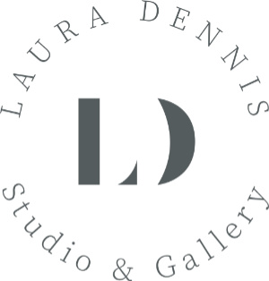

# Laura Dennis Studio & Gallery

[View the live project here](https://teerapat-bickerton.github.io/Laura-Dennis-Studio/)

In this project I wanted to help a friend who had recently opened a studio and art gallery, but her website wasn’t quite up to scratch. I wanted to create a webpage that would be a portal for Laura to showcase her work and help her to connect to more potential clients.

The webpage would be aimed at people who are interested in art, collectors, people seeking to commission new work or people visiting the beautiful Brecon Beacons hoping to see some local artists at work.

# Features

## Existing Features

### Header & Navigation Bar

* Featured on all five pages, the header will include the fully responsive navigation bar links of the Logo, Home, The Art, Workshops, Makers Corner and Laura, with each page containing the same corresponding feature. The header on the landing page will also contain a large image of Laura's gallery which will take up a large portion of the screen.
* This navigation bar will make it easy to navigate the site with an intuitive layout and without the user having to press the back button. The landing image should immediately help give the user an understanding and feeling for Laura’s gallery.

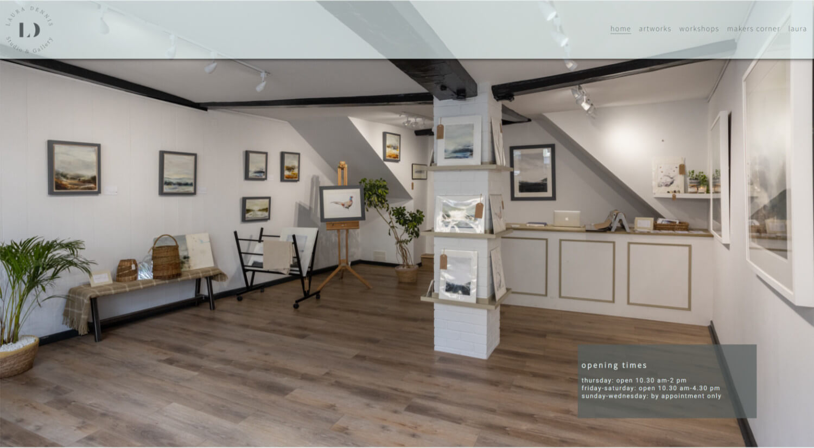

### Laura's Aesthetic Ethos Gallery

* When users scroll down the page, I want them to get a feeling of what Laura’s artwork is about and the place where she creates her it.
* In this section, rather than having lots of words trying to explain her aesthetic, I want to have lots of smaller photographs of Laura’s artwork in the context of her surroundings and in the mediums she uses.

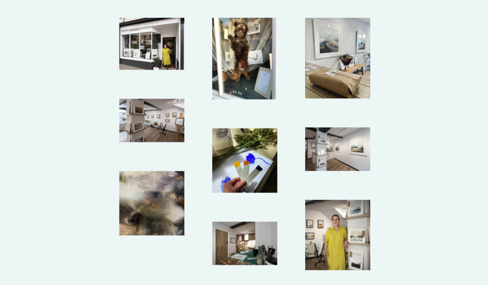

### Footer 

* This section will include the address of the studio as well as a contact number, and links to all relevant social media sites and will appear at the bottom of each page. 
* This will be valuable for potential clients to keep connected and updated to Laura’s artwork, as well as allowing clients to contact her. 

### Artworks

* The gallery area will give the user the ability to focus on individual works of art, showcasing artworks of the past and present in order to see the evolution of her style. Users will also be able to click on an individual image to enlarge.
* This section be valuable for the user to be able to take a closer look at the artworks and gain a better insight into her style.

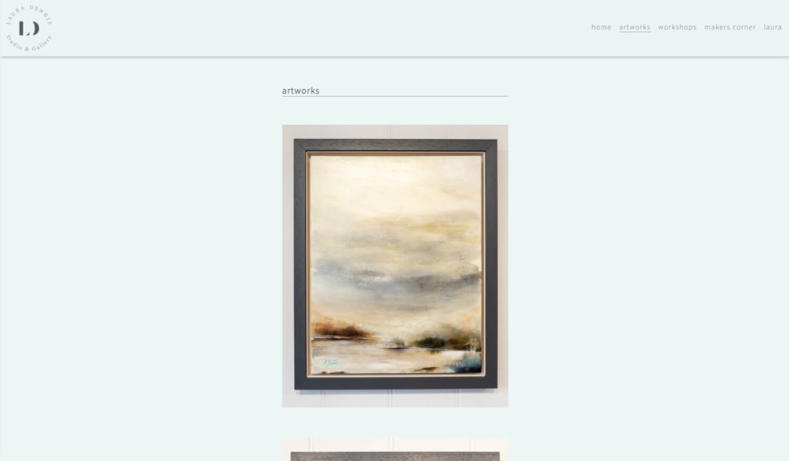

### Workshops

* The workshops page will feature a calendar of workshops and painting classes she will be running, either on online or in her studio. It will also contain a join session button will take them to a form in which users will be able to enter their name email address, and there will be a few radio buttons to allow users to choose which classes they wished to participate in.
* This section will be valuable to users would like to engage with art more and want to learn a new skill, or just have fun.

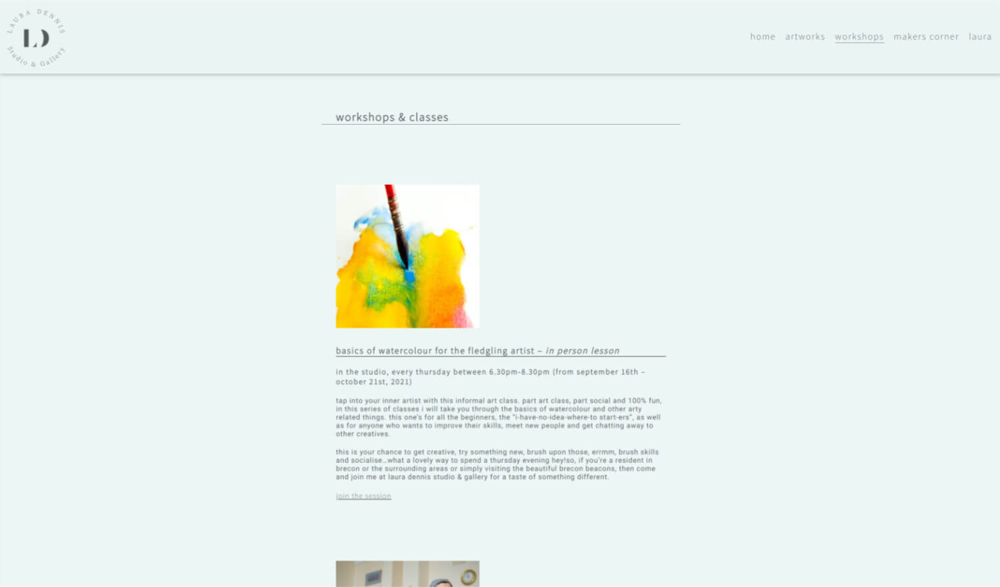

### Makers Corner

* This is an area where other local artists and creatives that Laura has displayed in here shop will be able to showcase themselves.
* This section will be valuable for users and tourists in the area who would be interested to see other local artists’ work.

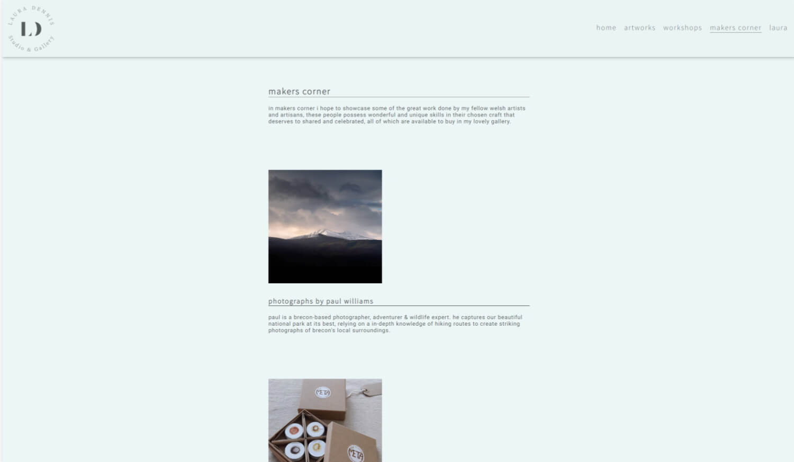

### Laura

* In this area I would like to put up a couple of pictures of Laura, and a little story about herself.
* This section will allow the user to gain more of a personal and emotional connection with Laura and give her artwork added context.

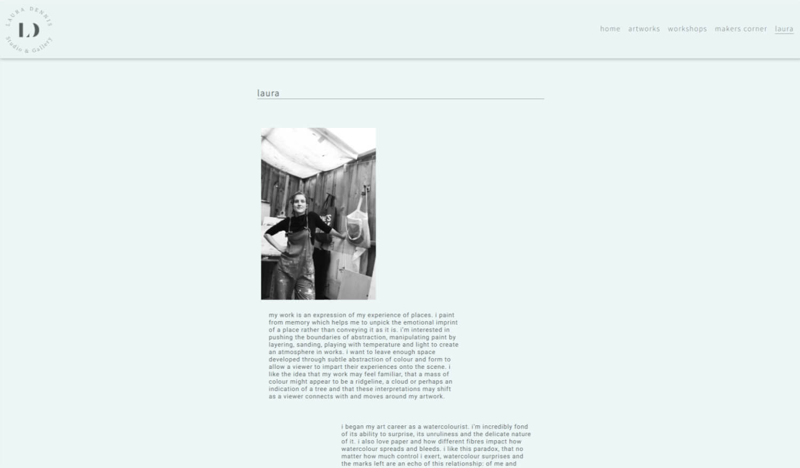

## Future Features to Implement

* I would like to, when I have the skillset, implement an e-commerce platform, specifically to the Makers Corner section, though could be added to all of her work in the future. 

# User Experience (UX)

## User stories

* First Time User Goals
    * As a first time user I want to be able instantly see and understand what the main purpose of the site is and what it is about.
    * As a first time visitor I would like to easily walk through the site with ease and find all the content.
    * As a first time user I want to find out more about Laura's work and Laura herself. I would also like to link up Laura's social media sites and understand her aesthetic.
* Returning Visitor Goals
    * As a returning visitor, I want to see if Laura has painted any new artworks.
    * As a returning visitor, I want to find out about workshops.
    * As a returning visitor, I want to find out about other Welsh artists and artisans.
* Frequent User Goals
    * As a frequent user, I want to see if there are new workshops.
    * As a frequent user, I want to find out about any new products from Welsh artists and artisans.

## Design 

* Colour Scheme
    * The two main colours are a dark green rgb(84, 92, 92) and pale eggshell blue rgb(225, 240, 240) that was chosen by Laura. 
* Typography
    * The Source Sans Pro and Roboto fonts are the main fonts used throughout the websites, with Helvetica and sans-serif used as back-ups in case the fonts can't be loaded by the browser. Source Sans Pro was chosen by Laura and Roboto was recommended as a complimentary font on Google Fonts, they are both clear, legible and modern.
* Imagery 
    * Imagery is vital, especially for a Artist's gallery website. The large landing image gives you a feel of what it is like to walk in to Laura's gallery. Images throughout the website are meant to draw the user in and get an understanding of who Laura is what is her style.
    
## Wireframes 

* Home Page Wireframes

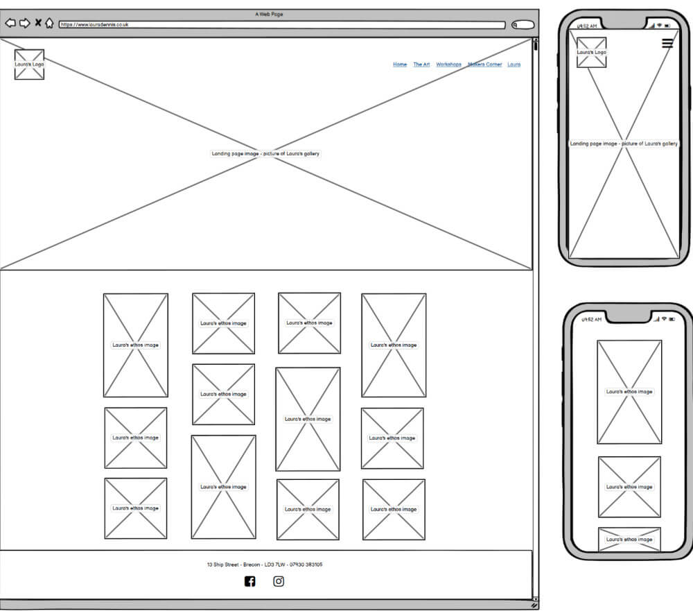

* Artworks Wireframes

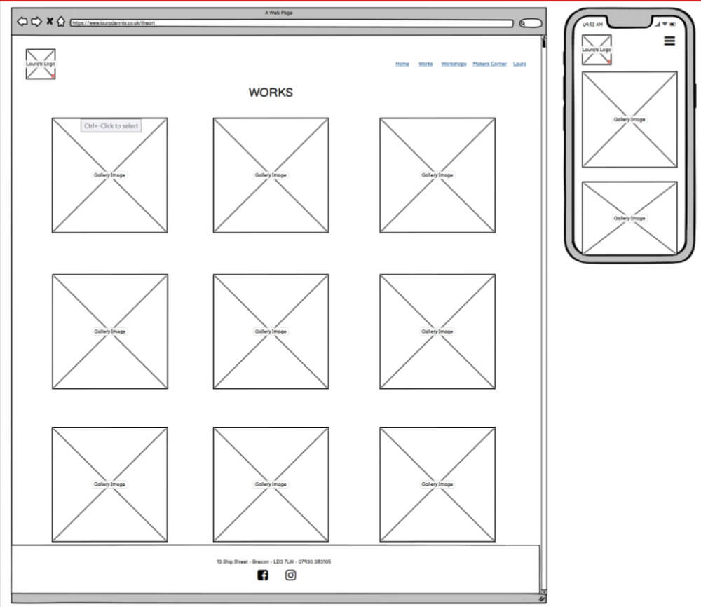

* Workshops wireframes

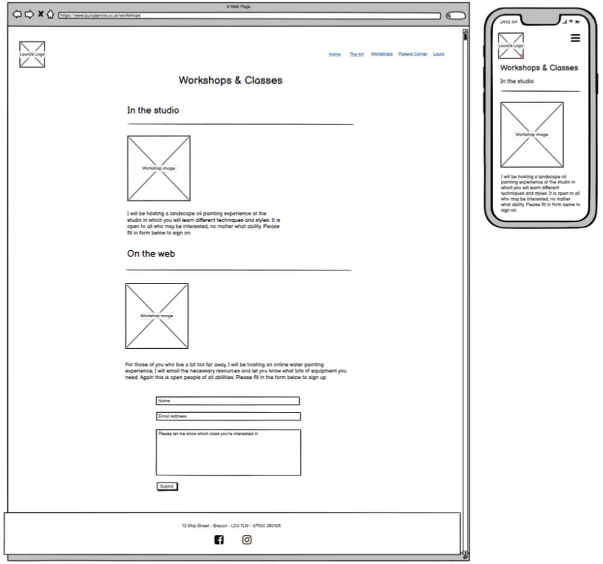

* Makers Corner Wireframes

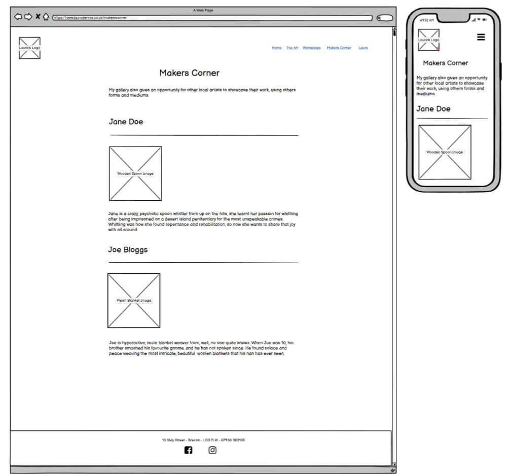

* Laura Wireframes

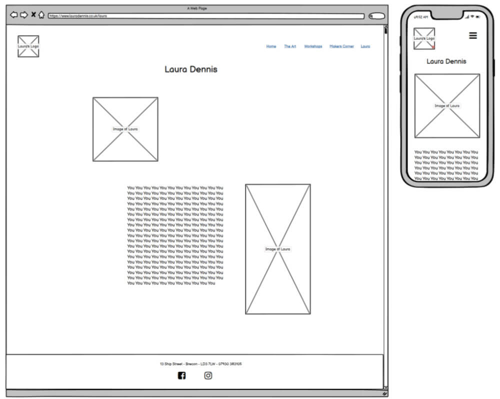